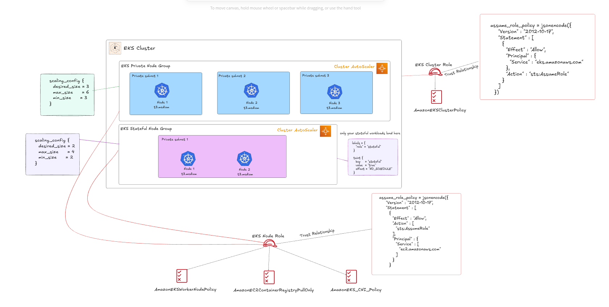

# EKS Infrastructure Provisioning with Terraform

This repository provides a comprehensive, production-ready Terraform configuration for provisioning Amazon EKS (Elastic Kubernetes Service) infrastructure. The setup supports both stateless and stateful microservices with enterprise-grade features including secrets management, auto-scaling, ingress controllers, and persistent storage.

---

## 🚀 Key Features

### Core Infrastructure
- **Modularized Terraform architecture** for maintainability and reusability
- **Multi-AZ VPC** with public and private subnets for high availability
- **EKS cluster** with managed node groups and advanced configurations
- **Remote state management** with S3 backend and DynamoDB locking

### Security & IAM
- **IAM Roles for Service Accounts (IRSA)** with OpenID Connect (OIDC) provider
- **AWS Secrets Manager integration** with fine-grained access control
- **Least privilege IAM policies** for all service accounts
- **Secure service account automation** with Kubernetes provider integration

### Storage & Persistence
- **EBS CSI driver** for dynamic persistent volume provisioning
- **Stateful node groups** with dedicated taints and labels
- **StorageClass configurations** for different workload requirements

### Networking & Ingress
- **AWS Load Balancer Controller** preconfigured with IRSA
- **Application Load Balancer (ALB)** support for ingress
- **Network Load Balancer (NLB)** capabilities
- **VPC CNI**, CoreDNS, and kube-proxy optimizations

### Auto-scaling & Monitoring
- **Cluster Autoscaler** for automatic eks nodes scale out and scale in support
- **Node group scaling policies** with customizable parameters
- **Comprehensive logging and monitoring** setup

### Secrets Management
- **AWS Secrets Store CSI Driver** pre-installed and configured
- **Kubernetes service accounts** with AWS Secrets Manager access
- **Secure secrets injection** into pods without hardcoded credentials

---

## 🧱 Architecture Overview

### Overview Architecure of EKS Infrastructure


### LLD Architecure of EKS Infrastructure



### EKS IRSA Permissions & Relationship


### EKS IRSA & OIDC Provider Relationship Workflow


## 📦 Modules Overview

### 🔹 VPC Module

Creates a secure, scalable VPC foundation:

- **Multi-AZ deployment** across 3 availability zones
- **Public subnets** for load balancers and NAT gateways
- **Private subnets** for EKS nodes and sensitive workloads
- **Internet Gateway** for public internet access
- **NAT Gateway** with Elastic IP for outbound private traffic
- **Route tables** with proper associations and routing rules

### 🔹 EKS Module

Comprehensive EKS cluster setup with enterprise features:

#### Core Cluster Configuration
- **EKS Control Plane** with public/private endpoint access
- **OIDC Identity Provider** for service account federation
- **Cluster encryption** for secrets at rest
- **CloudWatch logging** for audit, API, authenticator, controllerManager, and scheduler

#### Node Groups
- **General-purpose node group** for stateless workloads
- **Stateful node group** with dedicated taints and labels for persistent workloads
- **Auto-scaling configuration** with min/max/desired capacity
- **Spot instance support** for cost optimization (optional)

#### Add-ons and Extensions
- **VPC CNI** for advanced networking
- **CoreDNS** for cluster DNS resolution
- **kube-proxy** for service networking
- **EBS CSI Driver** for persistent volume management

#### Security Integration
- **AWS Secrets Manager** integration with IRSA
- **Fine-grained IAM policies** for service accounts
- **Pod Security Standards** enforcement
- **Network policies** support

---

## 🔧 Advanced Features

### 🔐 Secrets Management

**AWS Secrets Store CSI Driver Integration:**
```hcl
# Automatic service account creation with IRSA
resource "kubernetes_service_account" "secret_store_irsa" {
  metadata {
    name      = var.secret_store_service_account_name
    namespace = var.secret_store_service_account_namespace
    annotations = {
      "eks.amazonaws.com/role-arn" = aws_iam_role.secrets_irsa_role.arn
    }
  }
}
```

**Features:**
- **Fine-grained access control** to specific secrets by ARN
- **Automatic namespace creation** if needed
- **Read-only permissions** with least privilege principle
- **Service account automation** with proper OIDC federation

### ⚡ Auto-scaling

**Cluster Autoscaler with EKS node group auto-scaling support:**
```hcl
# Pre-installed and configured cluster autoscaler
resource "helm_release" "cluster_autoscaler" {
  name       = "cluster-autoscaler"
  repository = "https://kubernetes.github.io/autoscaler"
  chart      = "cluster-autoscaler"
  namespace  = "kube-system"
}
```

### 🗄️ Stateful Workloads Support

**Dedicated Stateful Node Group:**
- **Specialized taints and labels** for database workloads
- **EBS-optimized instances** with enhanced networking
- **Persistent volume support** with EBS CSI driver
- **Anti-affinity rules** for high availability
- **Custom storage classes** for different performance tiers

### 🌐 Ingress and Load Balancing

**AWS Load Balancer Controller:**
- **Application Load Balancer (ALB)** support
- **SSL/TLS termination** with ACM integration
- **WAF integration** for security (optional)
- **Target group binding** for advanced routing

---

## ⚙️ Getting Started

### 📌 Prerequisites

- **Terraform** >= 1.9.0 (required for native S3 state locking)
- **AWS CLI** configured with appropriate credentials
- **kubectl** >= 1.21
- **helm** >= 3.0 (for add-on installations)
- **AWS account** with EKS, VPC, IAM, and EC2 permissions

### 🚀 Deployment Steps

1. **Initialize Terraform:**
```bash
terraform init
```

2. **Review the plan:**
```bash
terraform plan
```

3. **Apply the configuration:**
```bash
terraform apply
```

4. **Configure kubectl:**
```bash
aws eks --region ap-southeast-1 update-kubeconfig --name my-eks-cluster
```

5. **Verify the setup:**
```bash
kubectl get nodes
kubectl get pods -A
helm list -A
```

---

## 📂 Directory Structure

```
├── backend/                          # Remote state configuration
│   ├── backend-access-user.tf       # IAM user for backend access
│   ├── main.tf                      # S3 bucket and DynamoDB table
│   └── ...
├── modules/
│   ├── eks/                                    # EKS module
│   │   ├── main.tf                             # EKS cluster and node groups
│   │   ├── ebs-csi-policy.tf                  # EBS CSI driver IAM policies
│   │   ├── eks_cluster_addons.tf              # EKS add-ons configuration
│   │   ├── cluster-autoscaler.tf              # Cluster autoscaler IRSA setup
│   │   ├── helm-cluster-autoscaler.tf         # Helm deployment for autoscaler
│   │   ├── ingress-policy.tf                  # Load balancer controller policies
│   │   ├── ingress-service-account.tf         # Service accounts for ingress
│   │   ├── secret-store-csi-policy.tf         # Secrets Store CSI driver policies
│   │   ├── secret-store-csi-service-accounts.tf # Service accounts for secrets
│   │   ├── outputs.tf                         # Module outputs
│   │   └── variables.tf                       # Module variables
│   └── vpc/                         # VPC module
│       ├── main.tf                  # VPC, subnets, gateways
│       ├── data.tf                  # Data sources (AZs, etc.)
│       ├── outputs.tf               # VPC outputs
│       └── variables.tf             # VPC variables
├── main.tf                          # Root module configuration
├── variables.tf                     # Root variables
├── outputs.tf                       # Root outputs
├── backend.tf                       # Backend configuration
└── versions.tf                      # Provider versions
```

---

## 📤 Comprehensive Outputs

### EKS Cluster Information
- `eks_cluster_name`: EKS cluster identifier
- `eks_cluster_endpoint`: Kubernetes API server endpoint

### Node Groups
- `eks_node_group_name`: General-purpose node group name
- `stateful_node_group_labels`: Labels applied to stateful nodes
- `stateful_node_group_taints`: Taints for stateful workload isolation

### Service Accounts
- `secret_store_service_account_name`: Secrets management service account
- `secret_store_service_account_namespace`: Service account namespace

### VPC Networking
- vpc_id: The ID of the created Virtual Private Cloud (VPC).

- vpc_cidr_block: The CIDR block range assigned to the VPC.

- public_subnet_ids: A list of IDs for all public subnets created within the VPC.

- private_subnet_ids: A list of IDs for all private subnets created within the VPC.

- availability_zones: List of availability zones used for subnet distribution.

- internet_gateway_id: The ID of the Internet Gateway attached to the VPC.

- nat_gateway_id: The ID of the NAT Gateway used for outbound internet access from private subnets.

- nat_eip: The Elastic IP address allocated to the NAT Gateway.

- public_route_table_id: Route table ID associated with the public subnets.

- private_route_table_id: Route table ID associated with the private subnets.

---

## 🛡️ Security Best Practices

### IAM and RBAC
- **Least privilege IAM policies** for all service accounts
- **OIDC federation** instead of long-lived credentials
- **Pod Security Standards** enforcement
- **RBAC policies** for fine-grained access control

### Network Security
- **Private node groups** with no direct internet access
- **Security groups** with minimal required ports
- **VPC Flow Logs** for network monitoring

### Secrets Management
- **AWS Secrets Manager** integration
- **Secrets Store CSI driver** for secure injection
- **No hardcoded secrets** in configurations
- **Automatic secret rotation** support

---

## 🔄 Post-Deployment Configuration

### Installing Additional Add-ons

**AWS Load Balancer Controller:**
```bash
helm repo add eks https://aws.github.io/eks-charts
helm install aws-load-balancer-controller eks/aws-load-balancer-controller \
  -n kube-system \
  --set clusterName=my-eks-cluster \
  --set serviceAccount.create=false \
  --set serviceAccount.name=aws-load-balancer-controller
```

**Metrics Server:**
```bash
kubectl apply -f https://github.com/kubernetes-sigs/metrics-server/releases/latest/download/components.yaml
```

## 🔧 Troubleshooting

### Common Issues

**Node Group Creation Fails:**
```bash
# Check IAM permissions
aws sts get-caller-identity
aws iam get-role --role-name EKS-NodeGroup-Role
```

**IRSA Not Working:**
```bash
# Verify OIDC provider
kubectl get configmap aws-auth -n kube-system -o yaml
aws iam list-open-id-connect-providers
```

**Auto-scaling Issues:**
```bash
# Check cluster autoscaler logs
kubectl logs -n kube-system deployment/cluster-autoscaler
kubectl describe nodes
```

### Useful Commands

```bash
# Get cluster info
kubectl cluster-info
kubectl get nodes -o wide

# Check add-ons
kubectl get daemonsets -A
kubectl get deployments -A

# Monitor auto-scaling
kubectl top nodes
kubectl get hpa -A

# Verify secrets integration
kubectl get secretproviderclasses -A
kubectl describe pod <pod-name>
```

---

## 🤝 Contributing

We welcome contributions! Please read our contributing guidelines and submit pull requests for any improvements.

### Development Setup
1. Fork the repository
2. Create a feature branch
3. Make your changes
4. Test with `terraform plan`
5. Submit a pull request

---

## 📄 License

This project is licensed under the MIT License - see the [LICENSE](LICENSE) file for details.

---

## 🙏 Acknowledgments

- [AWS EKS Best Practices Guide](https://aws.github.io/aws-eks-best-practices/)
- [Terraform AWS Provider Documentation](https://registry.terraform.io/providers/hashicorp/aws/latest/docs)
- [Kubernetes Documentation](https://kubernetes.io/docs/)
- [AWS Load Balancer Controller](https://kubernetes-sigs.github.io/aws-load-balancer-controller/)
- [Cluster Autoscaler Documentation](https://github.com/kubernetes/autoscaler/tree/master/cluster-autoscaler)

---

## 📞 Support

For questions and support:
- Create an issue in this repository
- Check the [AWS EKS Troubleshooting Guide](https://docs.aws.amazon.com/eks/latest/userguide/troubleshooting.html)
- Review Terraform AWS Provider issues