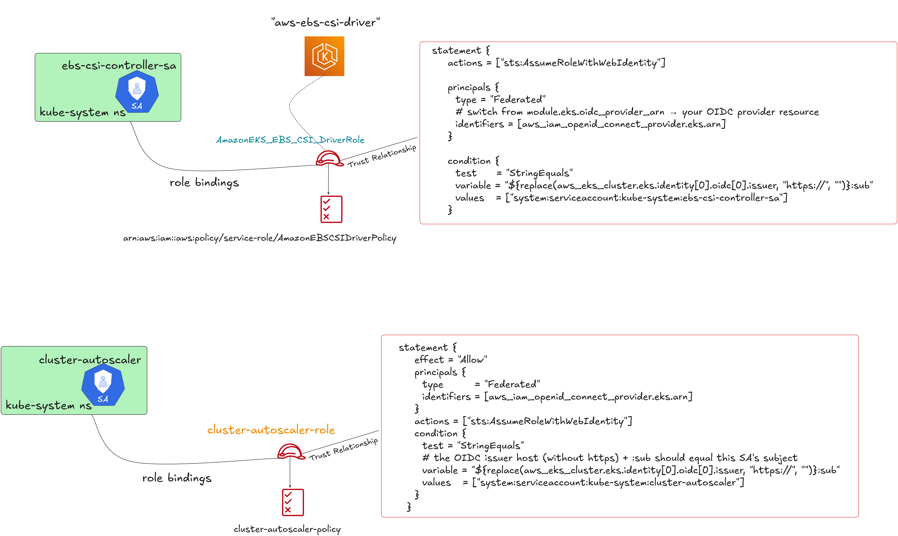

# EKS Infrastructure Provisioning with Terraform

This repository provides a comprehensive suite of Terraform modules to provision a complete Amazon EKS ecosystem. It is designed for production readiness, offering customized VPC networking, secure ingress and secrets management, and fine-grained access control. The architecture supports stateful microservices via the EBS CSI driver and implements robust, just-in-time node scaling strategies using Karpenter.

---

## 🚀 Key Features

### Core Infrastructure
- **Modularized Terraform Architecture**: Designed for high maintainability, reusability, and clean separation of concerns.

- **High Availability Networking**: Multi-AZ VPC architecture with strictly separated public and private subnets.

- **Production-Ready EKS**: Fully managed EKS cluster with managed node groups and optimized configurations.

- **Robust State Management**: Remote Terraform state management using S3 backend with native state file locking for team collaboration.

### Security & IAM
- **Flexible Cluster Authentication**: Configurable support for EKS Access Entries (API mode), legacy ConfigMap, or hybrid authentication (API_AND_CONFIG_MAP) for seamless access management.

- **Fine-Grained Access Control**: Full implementation of IAM Roles for Service Accounts (IRSA) via OIDC provider.

- **Secrets Management Integration**: AWS Secrets Manager integration for secure, rotated credential management.

- **Least Privilege Security**: Strict IAM policies applied to all service accounts to minimize attack surface.

- **Automated Authentication**: Secure service account automation leveraging the Terraform Kubernetes provider.

### Storage & Persistence
- **Stateful Workloads**: Integrated EBS CSI driver enabling dynamic persistent volume (PV) provisioning for databases and stateful apps.

### Networking & Ingress
- **Advanced Ingress**: AWS Load Balancer Controller pre-configured with IRSA for automated ALB provisioning.

- **Application Load Balancer (ALB)**: Native support for Kubernetes Ingress resources backed by AWS ALB.

- **Network Optimization**: Tuned configurations for VPC CNI, CoreDNS, and kube-proxy for maximum throughput and reliability.

### Node Auto-scaling
- **High-Performance Scaling**: "Just-in-time" node provisioning using Karpenter to rapidly launch right-sized instances based on pending pod requirements.

### Secrets Injection
- **CSI Driver Integration**: AWS Secrets Store CSI Driver pre-installed for seamless secret retrieval.

---

## 🧱 Architecture Overview

### Overview Network Architecture of EKS Infrastructure


### LLD Architecture of EKS Infrastructure


### EKS IRSA Permissions & Relationship




### EKS IRSA & OIDC Provider Relationship Workflow


## 📦 Modules Overview

### 🔹 VPC Module

Creates a secure, scalable VPC foundation:

- **Multi-AZ deployment** across 3 availability zones
- **Public subnets** for load balancers and NAT gateways
- **Private subnets** for EKS nodes and sensitive workloads
- **Internet Gateway** for public internet access
- **NAT Gateway** with Elastic IP for outbound private traffic
- **Route tables** with proper associations and routing rules

### 🔹 EKS Module

Comprehensive EKS cluster setup with enterprise features:

#### Core Infrastructure & Compute
- **Modular Architecture**: Clean separation of resources (eks-cluster.tf, node-group.tf) for maintainability.

- **Hybrid Compute Strategy**: Combines EKS Managed Node Groups for stable system workloads with Karpenter for dynamic application scaling.

- **EKS Add-ons Management**: Automated provisioning of essential add-ons via eks_cluster_addons.tf.

#### ⚡ Advanced Auto-scaling (Karpenter)
- **Complete Karpenter Stack**: Integrated setup including Helm installation (helm-karpenter.tf), IAM roles, and critical CRDs.

- **Declarative NodePools**: Pre-configured EC2NodeClass and NodePool manifests (karpenter_node_pools.tf) for just-in-time provisioning.

- **Karpenter-Specific Access**: Dedicated EKS Access Entries (karpenter_access_entry.tf) for secure node joining without legacy aws-auth.

#### 🔐 Security & Access Control
- **Modern Authentication**: Native support for EKS Access Entries (access_entry.tf) to manage cluster access via API, replacing the legacy ConfigMap.

- **IAM Roles for Service Accounts (IRSA)**: Granular IAM permissions for system components, including Karpenter and Ingress controllers.

- **Secrets Management**: integrated Secrets Store CSI Driver (secret-store-csi-*.tf) for securely injecting secrets into pods.

- **Network Security**: Fine-grained security group management (security-group.tf) for Control Plane and Worker Nodes.

#### 💾 Storage & Observability
- **Stateful Workloads**: IAM policies and setup for EBS CSI Driver (ebs-csi-policy.tf) to support persistent volumes.

- **Metrics Pipeline**: Integrated Metrics Server (helm-metrics-server.tf) deployment to support Horizontal Pod Autoscaling (HPA).

#### 🌐 Networking & Ingress
- **Ingress Ready** : IAM policies and Service Accounts pre-provisioned for the AWS Load Balancer Controller (ingress-policy.tf).
---

---

## ⚙️ Getting Started

### 📌 Prerequisites

- **Terraform** >= 1.9.0 (required for native S3 state locking)
- **AWS CLI** configured with appropriate credentials
- **kubectl** >= 1.21
- **helm** >= 3.0 (for add-on installations)
- **AWS account** with EKS, VPC, IAM, and EC2 permissions

### 🚀 Deployment Steps

1. **Initialize Terraform:**
```bash
terraform init
```

2. **Review the plan:**
```bash
terraform plan
```

3. **Apply the configuration:**
```bash
terraform apply
```

4. **Configure kubectl:**
```bash
aws eks --region ap-southeast-1 update-kubeconfig --name my-eks-cluster
```

5. **Verify the setup:**
```bash
kubectl get nodes
kubectl get pods -A
helm list -A
```

---

## 📂 Directory Structure

```
├── backend/                                   # Remote state configuration
│   ├── backend-access-user.tf                 # IAM user for backend access
│   ├── main.tf                                # S3 bucket creation
│   ├── outputs.tf                             # Backend resource outputs
│   ├── variables.tf                           # Backend variables
│   └── versions.tf                            # Provider versions for backend
├── modules/
│   ├── eks/                                   # EKS Module
│   │   ├── access_entry.tf                    # EKS Access Entries (API Auth mode)
│   │   ├── alb-ingress-controller.tf          # ALB Ingress Controller 
│   │   ├── data_karpenter.tf                  # Data sources for Karpenter (CRDs)
│   │   ├── ebs-csi-policy.tf                  # IAM policy for EBS CSI driver
│   │   ├── eks-cluster.tf                     # Main EKS cluster resource
│   │   ├── eks-cluster-ng-iam-roles.tf        # IAM roles for Managed Node Groups
│   │   ├── eks_cluster_addons.tf              # Managed Add-ons (CoreDNS, VPC CNI,EBS CSI driver, etc.)
│   │   ├── helm-karpenter.tf                  # Helm release for Karpenter controller
│   │   ├── helm-metrics-server.tf             # Helm release for Metrics Server
│   │   ├── ingress-policy.tf                  # IAM policy for AWS Load Balancer Controller
│   │   ├── ingress-service-account.tf         # Service Account for Ingress
│   │   ├── karpenter_access_entry.tf          # Access entry permissions for Karpenter nodes
│   │   ├── karpenter-iam-roles.tf             # IAM roles for Karpenter Controller & Nodes
│   │   ├── karpenter_main.tf                  # General Karpenter resources (Tagging/Namespace)
│   │   ├── karpenter_node_pools.tf            # EC2NodeClass and NodePool configurations
│   │   ├── karpenter_tags.tf                  # Add tags for Karpenter so it will know which SG to use
│   │   ├── node-group.tf                      # EKS Managed Node Groups (Stable/System)
│   │   ├── secret-store-csi-policy.tf         # IAM policy for Secrets Store CSI
│   │   ├── secret-store-csi-service-accounts.tf # Service Accounts for Secrets Store
│   │   ├── security-group.tf                  # Security Groups (Control Plane & Worker)
│   │   ├── outputs.tf                         # Module outputs
│   │   ├── variables.tf                       # Module variables
│   │   └── versions.tf                        # Provider version constraints
│   └── vpc/                                   # VPC Module
│       ├── main.tf                            # VPC, subnets, IGW, NAT gateways
│       ├── data.tf                            # Data sources (Availability Zones)
│       ├── outputs.tf                         # VPC outputs
│       └── variables.tf                       # VPC variables
├── main.tf                                    # Root module configuration
├── variables.tf                               # Root variables
├── outputs.tf                                 # Root outputs
├── backend.tf                                 # Backend configuration
└── versions.tf                                # Provider versions
```

---

## 🤝 Contributing

We welcome contributions! Please read our contributing guidelines and submit pull requests for any improvements.

### Development Setup
1. Fork the repository
2. Create a feature branch
3. Make your changes
4. Test with `terraform plan`
5. Submit a pull request

---

## 📄 License

This project is licensed under the MIT License - see the [LICENSE](LICENSE) file for details.

---

## 🙏 Acknowledgments

- [AWS EKS Best Practices Guide](https://aws.github.io/aws-eks-best-practices/)
- [Terraform AWS Provider Documentation](https://registry.terraform.io/providers/hashicorp/aws/latest/docs)
- [Kubernetes Documentation](https://kubernetes.io/docs/)
- [AWS Load Balancer Controller](https://kubernetes-sigs.github.io/aws-load-balancer-controller/)
- [Cluster Autoscaler Documentation](https://github.com/kubernetes/autoscaler/tree/master/cluster-autoscaler)

---

## 📞 Support

For questions and support:
- Create an issue in this repository
- Check the [AWS EKS Troubleshooting Guide](https://docs.aws.amazon.com/eks/latest/userguide/troubleshooting.html)
- Review Terraform AWS Provider issues